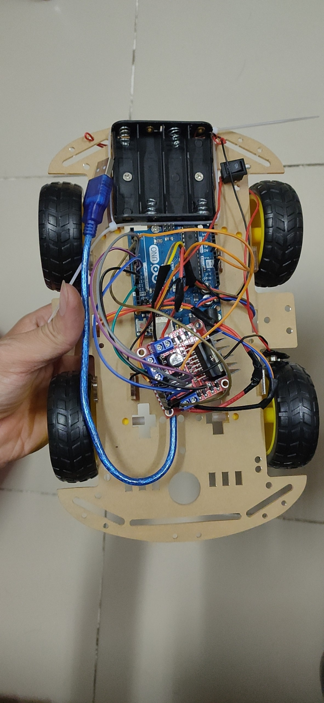
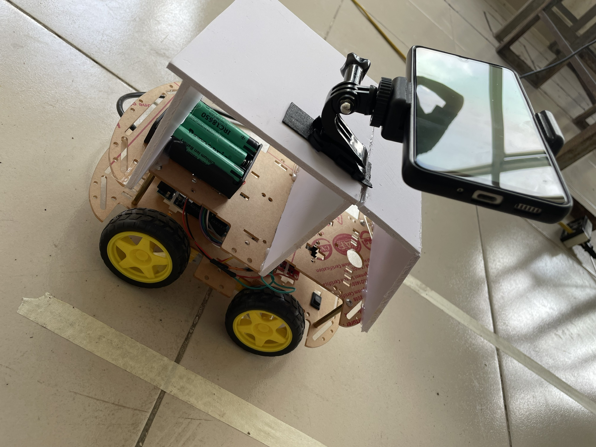

# PROJECT: HỆ THỐNG GIỮ LÀN ĐƯỜNG BẰNG XỬ LÍ ẢNH PYTHON

- Project này liên hệ đến lĩnh vực xe tự hành giúp có một góc nhìn cơ bản về hệ thống tự động trên ô tô   

### Thông tin về source code:

- Viết bằng ngôn ngữ C++ và Python
- Build trên Arduino IDE và Python IDLE Shell 3.11.2.

### Project bao gồm các kiến thức đã sử dụng như:

- Nhập xuất dữ liệu
- Giao tiếp giữa Python và C++, giữa C++ với hệ thống điều khiển lái.
- Sử dụng thư viện xử lí ảnh Python và thuật toán xử lí ảnh
- Thiết kế mạch điện tử điều khiển L298N của Arduino
- Nắm rõ các cơ chế hoạt động của mạch L298N để điều khiển bánh xe

## Cấu trúc hệ thống có:

- Arduino Uno R3
- Xe mô hình 
- Camera bằng điện thoại
- File Arduino viết bằng C++
- File Python xử lí ảnh

## Cấu trúc chương trình: 

- Camera thu nhận hình ảnh và gửi về để máy tính xử lí ảnh
- Bằng việc truyền nhận từ cáp USB từ máy tính đến Arduino, dữ liệu khi xử lí ảnh sẽ gửi đến Arduino
- Arduino sẽ điều khiển mạch L298N để thực hiện việc giữ làn.

Arduino Uno R3 kết nối mạch với L298N

Sản phẩm khi hoàn thành

